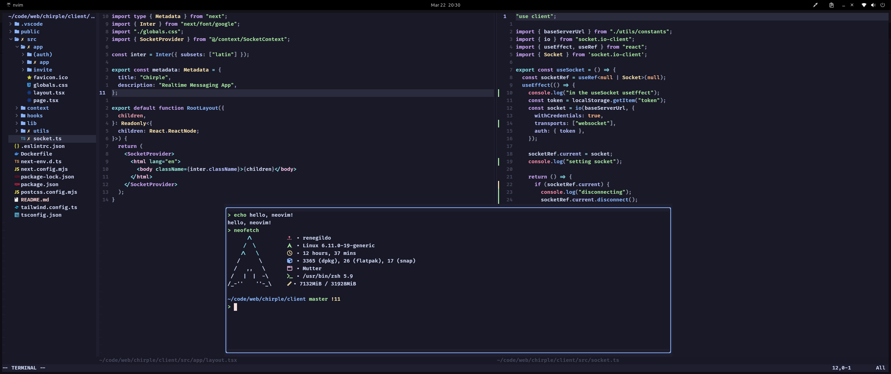

# Neovim dotfiles

## Overview
My ***Neovim*** configuration I use daily when writing code. In the screenshot it shows that I use Arch Linux but that's not real, I use Ubuntu in reallity (I broke my last Arch installation and I miss Arch's ascii art)

## Plugins
Searching any of these online you can find more information about each one.
 - **`actions-preview`**: For doing lsp actions easily with Telescope.
 - **`alpha`**: The startup menu.
 - **`autopairs`**: Auto closing pairs.
 - **`colorful-menu`**: Better looking autocomplete menu.
 - **`comment`**: Commenting code.
 - **`blink.cmp`**: Code auto completion.
 - **`gitsigns`**: Git signs in the lines.
 - **`inc-rename`**: Renaming stuff.
 - **`indentmini`**: Indentation decorations.
 - **`leetcode`**: Solving leetcode problems inside neovim.
 - **`lsp-config`**: LSP configuration.
 - **`markdown-preview`**: Mardown previewer.
 - **`mason`**: LSP Servers management.
 - **`mini`**: Contain many other utilities, but I am using just for the statusline.
 - **`neaterm`**: Integrated floating terminal.
 - **`nvim-tree`**: Files tree.
 - **`oil`**: File management.
 - **`smear-cursor`**: Cool animations added to cursor.
 - **`tailwind-tools`**: Tailwind stuff for frontend development.
 - **`telescope`**: Many uses, including easy files search.
 - **`treesitter`**: Syntax highlighting and more.
 - **`trouble`**: LSP diagnotisis.
> The theme being used is [Catppuccin Mocha](https://github.com/catppuccin/nvim).
---

## Additional resources
Here's some additional links I'd like to include related to Neovim configuration and theming.
 - [Catbbrew](https://catbbrew.com): Bake your own Catppuccin flavor easily.
 - [Awesome Neovim](https://github.com/rockerBOO/awesome-neovim): Collection of Neovim plugins, many of the ones I am using here I took from there.
 - [Advent of Neovim](https://youtube.com/playlist?list=PLep05UYkc6wTyBe7kPjQFWVXTlhKeQejM&si=b-DXxCEaNtN8seQW): TJ DeVries series on how to configure Neovim.
